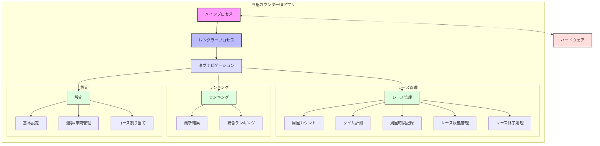
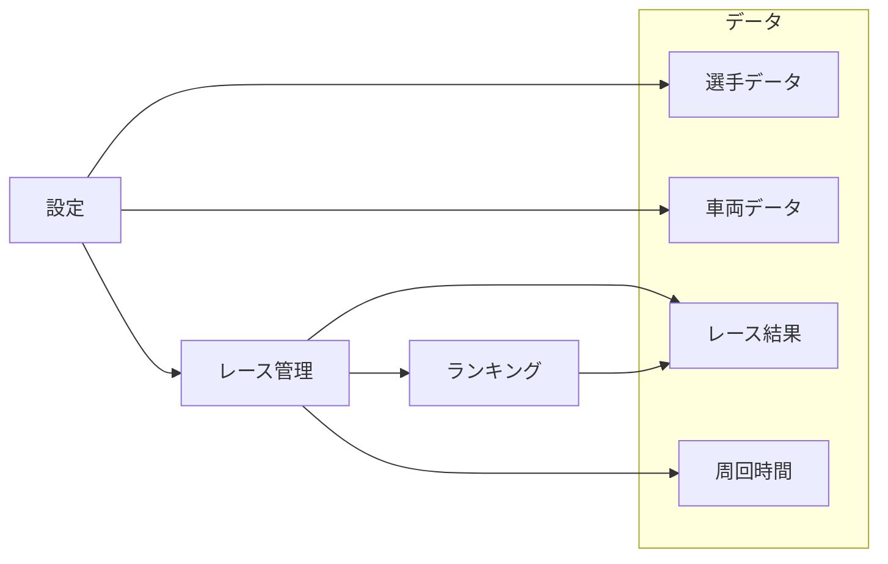
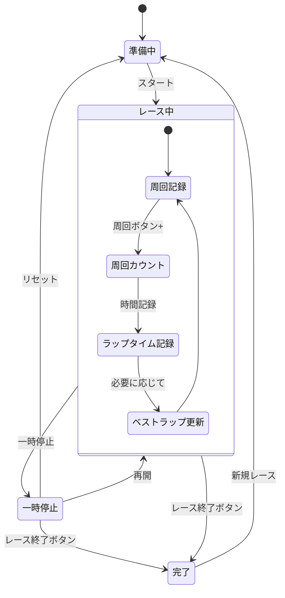
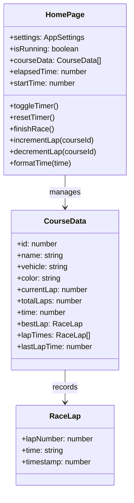
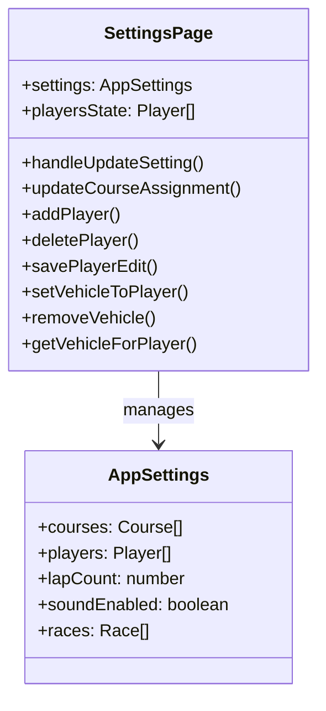
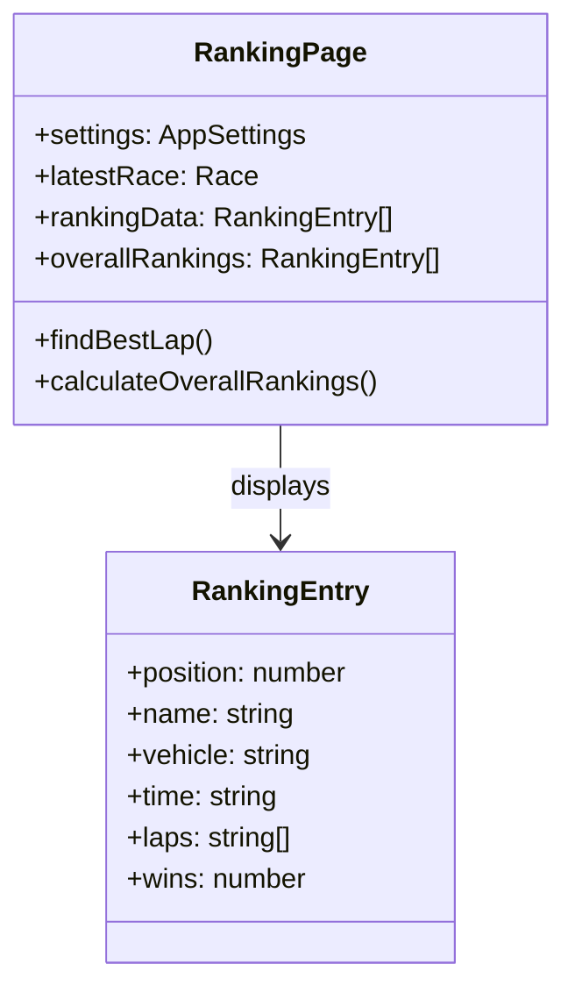
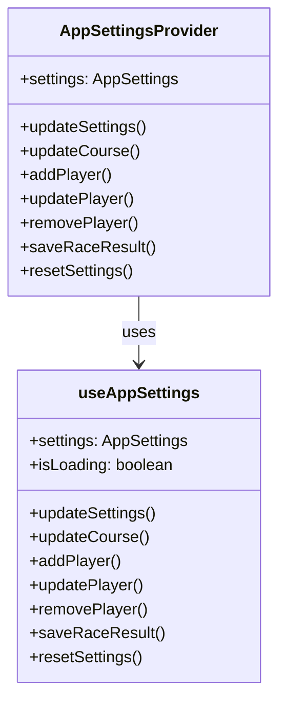
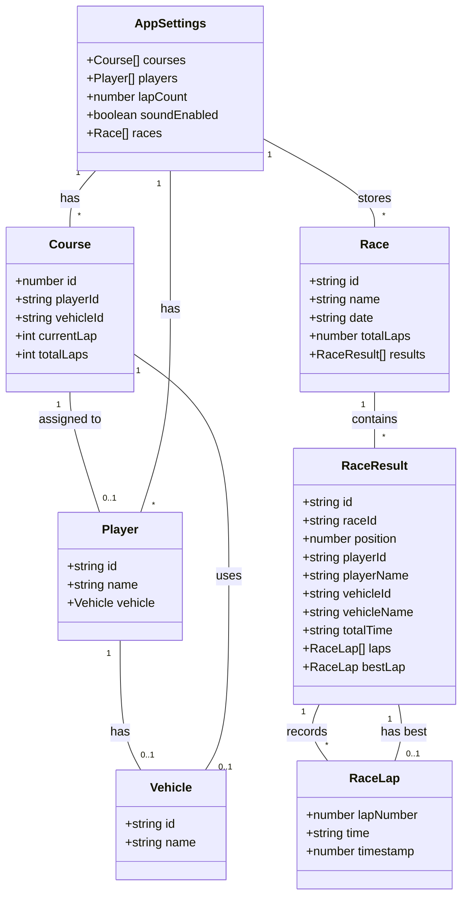

# 四駆カウンターUI

このプロジェクトは、ミニ四駆レース管理のためのElectronとNext.js、Chakra UIを使用したデスクトップアプリケーションです。レースの進行状況、タイム計測、周回管理、ランキングの管理などの機能を提供します。

## 機能概要

- **レース管理**: 4つのコースでのレースをリアルタイムにモニター
- **タイム計測**: 総経過時間のストップウォッチ機能と各選手の周回ごとのラップタイム記録
- **周回カウント**: 各コースの周回数を視覚的に表示とカウント管理
- **周回時間記録**: 各周回ごとのタイム記録とベストラップの表示
- **選手と車両管理**: 選手リストと車両情報の登録・編集・削除
- **ランキング表示**: レース結果とランキングの表示
- **設定**: レースの基本設定、選手/車両登録、コース割り当て
- **レース結果保存**: レース終了後に結果をローカルストレージに保存

## インストールと実行

### 必要条件

- Node.js 14.x 以上
- npm または yarn

### インストール手順

1. リポジトリをクローン
```
git clone https://github.com/yourusername/yonku-counter-ui.git
cd yonku-counter-ui
```

2. 依存パッケージをインストール
```
npm install
# または
yarn
```

3. 開発サーバーを起動
```
npm run dev
# または
yarn dev
```

4. アプリケーションのビルド
```
npm run build
npm run start
# または
yarn build
yarn start
```

5. 実行可能ファイルの作成
```
npm run package
# または
yarn package
```

## 開発方法

### プロジェクト構成

```
yonku-counter-ui/
├── electron-src/   # Electronメインプロセスのソースコード
├── main/           # メインプロセス関連コード
├── renderer/       # レンダラープロセス関連コード
│   ├── components/ # 共通コンポーネント
│   ├── pages/      # 各ページ (home.tsx, ranking.tsx, settings.tsx)
│   ├── utils/      # ユーティリティ関数と型定義
│   └── styles/     # スタイル関連ファイル
├── public/         # 静的ファイル
└── resources/      # アイコンなどのリソース
```

### フォルダ構造の説明

- **electron-src/**: Electronのメインプロセス側のコード
- **renderer/pages/**: アプリケーションの各画面
  - **home.tsx**: レース管理画面（メイン画面）
  - **ranking.tsx**: ランキング表示画面
  - **settings.tsx**: 設定画面
- **renderer/utils/**: 
  - **types.ts**: アプリケーション全体の型定義
  - **settings.ts**: 設定関連のユーティリティ関数
  - **AppSettingsContext.tsx**: アプリケーション設定のコンテキスト提供

### 主要なコンポーネント間のデータフロー

- **AppSettingsContext**: 全画面間でデータを共有するためのReactコンテキスト
- **設定 → レース画面**: 設定データをコンテキスト経由で共有
- **レース画面 → ランキング画面**: レース結果をコンテキスト経由で共有

## 技術スタック

- **フレームワーク**: Electron + Next.js
- **UI**: Chakra UI
- **言語**: TypeScript
- **状態管理**: React Context API
- **データ永続化**: localStorage

## 画面構成

アプリケーションは主に3つのタブで構成されています：

### 1. レース管理画面

- 左側に4コース分の選手・車両情報
- 右側に大きく経過時間を表示
- 各コースの周回数を管理するボタン
- スタート/一時停止、リセットなどのコントロールボタン

### 2. ランキング画面

- 最新レース結果表示
- 総合ランキング表示

### 3. 設定画面

- 基本設定（周回数など）
- 選手/車両登録管理
- コースへの選手と車両の割り当て

## 詳細機能

### レース管理

1. **タイマー機能**
   - スタート/一時停止
   - リセット 
   - レース終了時の結果保存

2. **コース管理**
   - 4コース同時管理
   - 各コースの選手名と車両名表示
   - コース別の色分け表示

3. **周回管理**
   - プラス/マイナスボタンによる周回カウント
   - 設定した目標周回数の表示と進捗バー

4. **タイム計測**
   - 総経過時間（ストップウォッチ）
   - 各周回ごとのラップタイム記録
   - ベストラップのハイライト表示
   - 周回ごとのタイム表示

5. **レース終了処理**
   - レース終了ボタン
   - 確認ダイアログ
   - 結果自動保存
   - ランキングページへ自動遷移

### 設定管理

1. **基本設定**
   - 周回数設定（1〜20周）
   - サウンド有効/無効

2. **選手/車両管理**
   - 選手の追加/編集/削除
   - 車両の追加/編集/削除
   - 選手と車両の紐付け

3. **コース割り当て**
   - 各コースへの選手割り当て
   - 選手に応じた車両の選択

### ランキング表示

1. **レース結果表示**
   - 順位
   - 選手名/車両名
   - 総合タイム
   - 各周回のラップタイム
   - ベストラップ

2. **データ保存**
   - ローカルストレージによるデータ永続化
   - レース履歴保存

## システム構成図



## データフロー



## 状態管理



## データ構造

```typescript
// 選手情報
interface Player {
  id: string;
  name: string;
  vehicle: Vehicle | null;
}

// 車両情報
interface Vehicle {
  id: string;
  name: string;
}

// コース情報
interface Course {
  id: number;
  playerId: string | null;
  vehicleId: string | null;
}

// 周回記録
interface RaceLap {
  lapNumber: number;
  time: string;  // "mm:ss.ms" 形式
  timestamp: number;  // ミリ秒単位のタイムスタンプ
}

// レース結果
interface RaceResult {
  id: string;
  raceId: string;
  position: number;
  playerId: string | null;
  playerName: string;
  vehicleId: string | null;
  vehicleName: string;
  totalTime: string;
  laps: RaceLap[];
  bestLap: RaceLap | null;
}

// レース情報
interface Race {
  id: string;
  name: string;
  date: string;
  totalLaps: number;
  results: RaceResult[];
}

// アプリ設定
interface AppSettings {
  courses: Course[];
  players: Player[];
  lapCount: number;
  soundEnabled: boolean;
  races: Race[];
}
```

## 主要コンポーネント

### レース管理画面 (home.tsx)



### 設定画面 (settings.tsx)



### ランキング画面 (ranking.tsx)



### データ管理 (AppSettingsContext.tsx)



### コンポーネント関連



## UI実装詳細

### レース管理画面

1. **レイアウト**:
   - 左側: 4コースのレース情報
   - 右側: 大きな経過時間表示

2. **コース情報表示**:
   - コース番号（大きなアイコンで表示）
   - 選手名・車両名
   - 周回数（現在/目標）
   - 進捗バー
   - 周回タイム（各周ごとのバッジ表示）
   - ベストラップ表示（色付きハイライト）

3. **コントロール**:
   - スタート/一時停止ボタン
   - リセットボタン
   - レース終了ボタン（確認ダイアログ付き）

### 設定画面

1. **3つのタブ**:
   - 基本設定タブ（周回数、サウンドON/OFF）
   - 選手/車両登録タブ（選手一覧、車両管理）
   - コース割り当てタブ（コースごとの選手・車両割り当て）

2. **選手管理**:
   - 一覧表示
   - 追加・編集・削除機能
   - 車両の紐付け管理

3. **自動保存**:
   - ローカルストレージを使用したデータ永続化

## 開発環境のセットアップ

```bash
# リポジトリをクローン
git clone <リポジトリURL>

# 依存関係のインストール
cd yonku-counter-ui
npm install

# 開発サーバーの起動
npm run dev
```

## ビルド

```bash
# パッケージ化
npm run build

# 配布用ファイルの生成
npm run dist
```

## 最近追加された機能の詳細

### 1. 周回時間記録機能

#### 機能概要
各コースの選手が周回を完了するたびに、そのラップタイムを記録し表示する機能です。

#### 実装詳細
- `home.tsx`の`courseData`にラップタイム記録用のプロパティを追加
  - `lapTimes`: 各周回のタイム記録を保存する配列
  - `bestLap`: ベストラップの情報を保存するオブジェクト
  - `lastLapTime`: 前回のラップ完了時間（次のラップタイム計算用）

- `incrementLap`関数の拡張
  - 周回カウント時に現在の時間と前回のラップ完了時間の差分からラップタイムを計算
  - ベストラップの判定と更新処理を追加
  - ラップタイムをRaceLapオブジェクトとしてlapTimes配列に保存

- UIの拡張
  - 各コースのセクションにラップタイム表示欄を追加
  - ベストラップはハイライト表示
  - 各周回のタイムをバッジとして表示

### 2. レース終了機能

#### 機能概要
レース終了ボタンをクリックするとレースを終了し、結果を保存してランキング画面に遷移する機能です。

#### 実装詳細
- `home.tsx`に`finishRace`関数を実装
  - タイマーを停止
  - 各コースの情報からRaceResultオブジェクトを生成
  - 順位付け（周回数が多い順、同じ場合は時間が短い順）
  - レース情報をRaceオブジェクトにまとめて保存

- 確認ダイアログの実装
  - Chakra UIのAlertDialogを使用
  - ユーザー確認後にレース終了処理を実行

- ランキング画面への自動遷移
  - レース終了後、自動的にranking.tsxに遷移

### 3. 設定データの共有機能

#### 機能概要
アプリケーション全体で設定データを共有し、一貫した状態を維持する機能です。

#### 実装詳細
- `AppSettingsContext.tsx`でコンテキストを提供
  - 全画面間でのデータと操作関数の共有
  - ローカルストレージでの永続化

- 主な提供機能
  - `updateSettings`: 全体設定の更新
  - `updateCourse`: 特定コースの設定更新
  - `addPlayer`: 選手追加
  - `updatePlayer`: 選手情報更新
  - `removePlayer`: 選手削除
  - `saveRaceResult`: レース結果保存

## 今後の計画と改善点

### 短期間での改善計画

1. **レースの自動終了機能**
   - 全選手が設定周回数に達した際に自動的にレースを終了する機能
   - レース制限時間の設定と、制限時間経過後の自動終了機能

2. **より高度な周回時間分析**
   - セクションタイムの記録と表示
   - グラフでのラップタイム推移表示
   - 選手間のラップタイム比較

3. **UIの改善**
   - モバイル対応のレスポンシブデザイン
   - ダークモード対応
   - カスタムテーマ設定

### 中長期的な機能拡張計画

1. **ハードウェア連携機能**
   - 実際のセンサーやカウンターと連携するための拡張インターフェース
   - 自動カウント機能との統合

2. **データエクスポート/インポート**
   - 結果のCSVやJSONでのエクスポート
   - 過去のレースデータのインポート
   - データバックアップ機能

3. **マルチユーザー対応**
   - 複数の管理者によるレース運営サポート
   - 権限管理

4. **クラウド連携**
   - レース結果のオンライン共有
   - リアルタイムでの結果公開
   - 複数デバイスでの同期

5. **統計分析機能**
   - 選手や車両の統計データ分析
   - パフォーマンストレンド表示
   - 改善提案機能

## コントリビュート

プロジェクトへの貢献を歓迎します。以下の手順でコントリビュートが可能です：

1. リポジトリをフォーク
2. 機能ブランチを作成 (`git checkout -b feature/amazing-feature`)
3. 変更をコミット (`git commit -m 'Add some amazing feature'`)
4. ブランチにプッシュ (`git push origin feature/amazing-feature`)
5. プルリクエストを開く

## ライセンス

MIT License - 詳細はLICENSEファイルを参照してください。