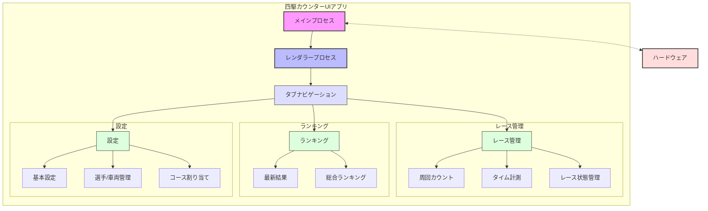
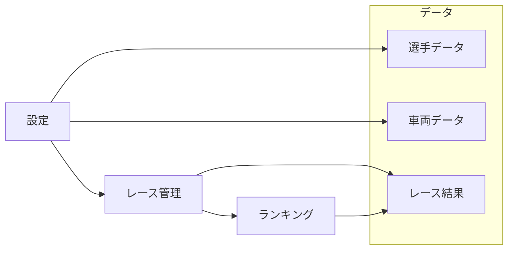
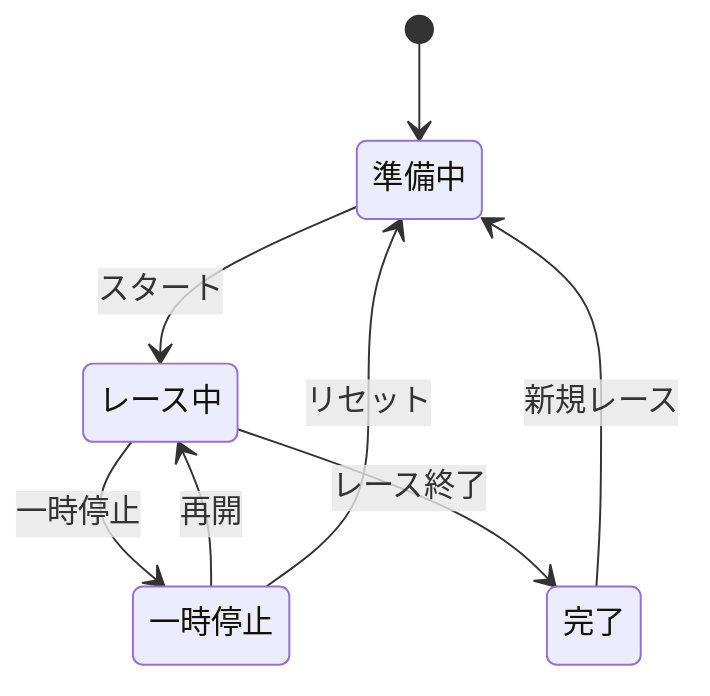
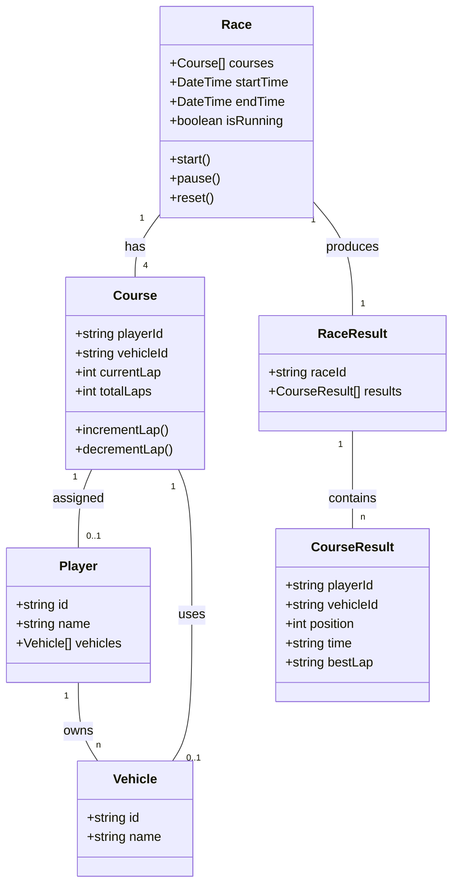

# 四駆カウンターUI

このプロジェクトは、ミニ四駆レース管理のためのElectronとNext.js、Chakra UIを使用したデスクトップアプリケーションです。レースの進行状況、タイム計測、ランキングの管理などの機能を提供します。

## 機能概要

- **レース管理**: 4つのコースでのレースをリアルタイムにモニター
- **タイム計測**: 経過時間のストップウォッチ機能
- **周回カウント**: 各コースの周回数を視覚的に表示
- **選手と車両管理**: 選手リストと車両を管理
- **ランキング表示**: レース結果とランキングの表示
- **設定**: レースの基本設定、選手/車両登録、コース割り当て

## 技術スタック

- **フレームワーク**: Electron + Next.js
- **UI**: Chakra UI
- **言語**: TypeScript

## 画面構成

アプリケーションは主に3つのタブで構成されています：

### 1. レース管理画面

- 左側に4コース分の選手・車両情報
- 右側に大きく経過時間を表示
- 各コースの周回数を管理するボタン
- スタート/一時停止、リセットなどのコントロールボタン

### 2. ランキング画面

- 最新レース結果表示
- 総合ランキング表示

### 3. 設定画面

- 基本設定（周回数など）
- 選手/車両登録管理
- コースへの選手と車両の割り当て

## システム構成図



## データフロー



## 状態管理



## クラス図



## 開発環境のセットアップ

```bash
# リポジトリをクローン
git clone <リポジトリURL>

# 依存関係のインストール
cd yonku-counter-ui
npm install

# 開発サーバーの起動
npm run dev
```

## ビルド

```bash
# パッケージ化
npm run build

# 配布用ファイルの生成
npm run dist
```

---

© 2025 NLAB プロジェクト